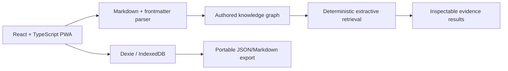

# Architecture Overview

## Product contract

EvidenceWeave Graph Studio is a local-first knowledge graph and GraphRAG workspace. Its baseline must remain useful without an account, paid API, server-side document database, or generative model.

## Current foundation

The first implementation deliberately builds the non-AI core before local ML. Authored links are deterministic and reversible; later inferred entities and relationships must carry provenance and approval state.

## Data flow

1. A note is created or imported in the browser.
2. Markdown is stored in IndexedDB.
3. Wiki links, tags, and typed frontmatter are parsed locally.
4. The graph is rebuilt from authored links; unresolved links are kept visible rather than invented.
5. Deterministic evidence search scores note text and returns source excerpts.
6. Export is initiated only by the user.

No application-server upload is required by this flow.

## Planned layers

- Authored graph: wiki links, tags, user-created edges.
- Document graph: imported documents, pages, blocks, chunks.
- Entity graph: reviewed people, organizations, products, topics, metrics, dates.
- Semantic graph: conservative, provenance-linked inferred similarities.
- Temporal graph: created/modified/mentioned/valid-time relationships.
- Retrieval: BM25 + vector + graph traversal + community + temporal, fused with RRF.
- Answer proof: claim citations, graph paths, conflicts, retrieval contribution, provenance.

## Clean-room boundary

EvidenceWeave is not affiliated with Obsidian. It may implement general knowledge-work patterns, but must not copy Obsidian source code, proprietary assets, CSS, screenshots, plugin APIs, branding, or interface trade dress.
